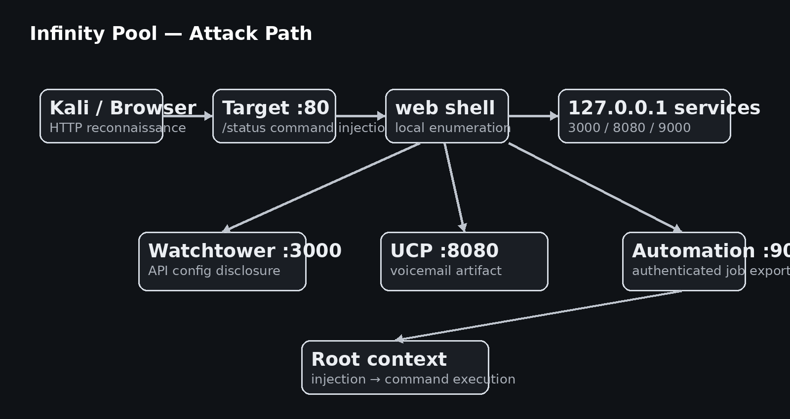

# ♾️ Infinity Pool — Complete Technical Walkthrough


> 
<div align="center">

> **Professional TryHackMe Penetration Testing Documentation**


  
**Author:** Anurag Revankar

Cybersecurity Portfolio • Penetration Testing • TryHackMe Walkthrough

</div>

---

# Executive Summary

## Overview

**Infinity Pool** is a realistic Linux-based Capture The Flag (CTF) room hosted on **TryHackMe** that simulates the internal infrastructure of a luxury hospitality organization. Rather than exposing numerous public services, the environment intentionally limits its external attack surface while relying on multiple interconnected **localhost-only administrative services**.

This challenge demonstrates how a single web application vulnerability can become the starting point for a complete compromise by chaining together information disclosure, internal network pivoting, authenticated API abuse, and privilege escalation.

The documented attack path begins with traditional reconnaissance against publicly exposed services, identifies a vulnerable network diagnostic utility, obtains command execution through **OS Command Injection**, establishes an interactive shell, enumerates hidden internal services, investigates administrative dashboards, extracts operational artifacts, abuses an authenticated automation API, and finally reaches **root-level command execution**.

The room closely resembles real-world internal web infrastructure where operational tooling, monitoring services, telephony dashboards, and automation workers coexist behind a web application.

---

## Assessment Goals

The primary objectives during this assessment were:

- Enumerate externally accessible services.
- Identify hidden web resources and administrative endpoints.
- Validate user input handling.
- Exploit remote command execution.
- Obtain an interactive shell.
- Enumerate internal-only services.
- Investigate localhost administrative applications.
- Discover operational secrets without exposing challenge answers.
- Analyze internal REST APIs.
- Escalate privileges through chained application weaknesses.
- Produce professional penetration testing documentation suitable for a cybersecurity portfolio.

---

## Skills Demonstrated

| Domain | Skills |
|--------|--------|
| Reconnaissance | Nmap, HTTP Enumeration, robots.txt Discovery |
| Web Security | OS Command Injection, Endpoint Enumeration |
| Linux | Reverse Shells, PTY Stabilization, Local Enumeration |
| Internal Pivoting | SSH Port Forwarding, Loopback Service Discovery |
| API Security | REST API Enumeration, Configuration Analysis |
| Privilege Escalation | Authenticated Command Injection |
| Reporting | Professional Vulnerability Documentation |

---

# Lab Information

| Property | Value |
|----------|-------|
| Platform | TryHackMe |
| Room Name | Infinity Pool |
| Operating System | Linux |
| Difficulty | Medium |
| Category | Web Application Security / Linux |
| Attack Vector | Web → Internal Services → Root |
| Documentation Type | Professional Portfolio Walkthrough |

---

# Engagement Scope

This assessment was performed **entirely within an authorized TryHackMe laboratory environment**.

## Scope Included

- Network reconnaissance.
- Service enumeration.
- Web application testing.
- Input validation testing.
- Reverse shell access.
- Local Linux enumeration.
- Internal application investigation.
- Authenticated API interaction.
- Privilege escalation validation.

## Scope Excluded

The following sensitive items have intentionally been removed:

- User Flag
- Root Flag
- Passwords
- SSH Private Keys
- Automation Keys
- Tokens
- Challenge Secrets

This repository demonstrates **methodology instead of challenge answers**.

---

# Attack Narrative

Infinity Pool is intentionally designed around **attack chaining**.

Instead of immediately exposing privileged services, the attacker must continuously enumerate new trust boundaries after every successful compromise.

The attack progression looked like this:

```text
Internet
   │
   ▼
Nmap Enumeration
   │
   ▼
HTTP Web Application
   │
   ▼
robots.txt
   │
   ▼
Hidden Status Endpoint
   │
   ▼
OS Command Injection
   │
   ▼
Reverse Shell
   │
   ▼
Internal Service Enumeration
   │
   ▼
Watchtower Dashboard
   │
   ▼
Configuration Disclosure
   │
   ▼
FreePBX UCP
   │
   ▼
Voicemail Artifact
   │
   ▼
Automation API
   │
   ▼
Authenticated Command Injection
   │
   ▼
Root Execution
```

---

# Attack Chain Architecture

> Repository Image

<p align="center">

</p>

### Attack Flow Summary

| Stage | Outcome |
|--------|---------|
| External Enumeration | HTTP & SSH identified |
| robots.txt | Hidden operational endpoint discovered |
| `/status` | Vulnerable connectivity checker |
| Command Injection | Arbitrary command execution |
| Reverse Shell | Initial Linux shell obtained |
| Local Enumeration | Hidden localhost services identified |
| Watchtower | Internal operational dashboard discovered |
| Configuration API | Internal endpoints disclosed |
| UCP | Operational voicemail investigated |
| Automation Service | Root-level API discovered |
| Export Job | Command Injection as root |

---

# Penetration Testing Methodology

This walkthrough follows a structured penetration testing lifecycle similar to PTES and OWASP Web Security Testing Guide.

## Phase Overview

| Phase | Objective |
|-------|-----------|
| Reconnaissance | Identify exposed services. |
| Enumeration | Discover web resources and technologies. |
| Vulnerability Discovery | Validate insecure user input handling. |
| Exploitation | Gain remote command execution. |
| Initial Access | Obtain reverse shell. |
| Post Exploitation | Enumerate Linux host. |
| Internal Discovery | Enumerate loopback services. |
| Lateral Pivot | Access internal dashboards. |
| Privilege Escalation | Execute commands in root context. |
| Reporting | Document vulnerabilities and mitigations. |

---

# Kill Chain Mapping

| Cyber Kill Chain Phase | Infinity Pool Stage |
|-------------------------|--------------------|
| Reconnaissance | Nmap, HTTP Enumeration |
| Weaponization | Payload Construction |
| Delivery | Vulnerable Input Field |
| Exploitation | OS Command Injection |
| Installation | Reverse Shell |
| Command & Control | Interactive Shell |
| Actions on Objectives | Internal Pivot + Root Execution |

---

# Tools Used

## Operating System

- Kali Linux

---

## Enumeration Tools

| Tool | Purpose |
|------|---------|
| Nmap | Service enumeration |
| curl | Internal API testing |
| ss | Local socket enumeration |
| nc | Reverse shell listener |

---

## Web Testing Tools

| Tool | Purpose |
|------|---------|
| Browser Developer Tools | Manual inspection |
| curl | REST API interaction |
| SSH | Local Port Forwarding |

---

## Linux Enumeration

| Command | Purpose |
|---------|---------|
| whoami | Current user |
| id | Privileges |
| pwd | Current directory |
| hostname | Host identification |
| uname -a | Kernel information |
| ss -lntp | Listening services |
| ls -la | File enumeration |

---

## Documentation Tools

- Markdown
- GitHub Pages
- Draw.io (architecture visualization)
- Screenshots captured from Kali Linux

---

# Initial Reconnaissance

Reconnaissance focused on identifying the exposed attack surface before interacting with the application.

---

## Network Enumeration

The first activity was a version scan.

```bash
nmap <TARGET_IP> -sV
```

### Objective

- Identify exposed TCP services.
- Fingerprint application versions.
- Discover attack surface.

---

## Nmap Findings

| Port | State | Service |
|------|-------|---------|
| 22 | Open | SSH |
| 80 | Open | HTTP |

### Analysis

Only two externally visible services significantly reduced the apparent attack surface.

This is a common real-world design pattern where sensitive administrative services remain bound to localhost instead of public interfaces.

---

## Initial Target Observation

The web application presented a polished landing page for **Byte Lotus Hospitality Group**, advertising a fictional luxury hotel experience.

### Initial Landing Page

<p align="center">

</p>

### Visible Functionality

- Suites
- Amenities
- Contact
- Reservation CTA

### Security Observation

Nothing immediately suggested administrative functionality.

The interface intentionally resembles a production landing page.

---

# Technology Fingerprinting

Basic HTTP inspection revealed several implementation clues.

### Observations

- Gunicorn web server.
- Python backend.
- Static assets served from the application.
- Minimal client-side JavaScript.
- Internal branding references.

### Initial Hypothesis

The application likely contained hidden operational endpoints used by staff.

This directed enumeration toward hidden resources instead of visible navigation.

---

# Directory Enumeration Strategy

Rather than brute-forcing immediately, lightweight discovery techniques were used first.

### Enumeration Priorities

1. robots.txt
2. HTML source.
3. Static assets.
4. Hidden navigation.
5. Common administrative paths.

---

# robots.txt Discovery

The robots.txt file exposed internal operational paths.

### Interesting Paths

```text
/status
/internal/
```

### Security Significance

The `/status` endpoint appeared operational rather than customer-facing, making it a high-priority target for manual inspection.

The `/internal/` endpoint did not expose useful content during the initial request.

---

# Endpoint Analysis

The discovered endpoint exposed a **Sister Property Connectivity Checker** intended for staff.

### Status Page

<p align="center">

</p>

### Interface Components

| Component | Purpose |
|-----------|---------|
| Host Input Field | Remote property hostname/IP |
| Check Button | Connectivity validation |
| Internal Notice | Authorized staff only |

### Initial Assessment

The feature appeared to execute a network connectivity operation based on user-supplied input.

This immediately suggested testing for:

- Input validation.
- SSRF.
- Command Injection.
- Shell metacharacters.
- Localhost access.

---

# Reconnaissance Summary

## Assets Identified

| Asset | Risk |
|-------|------|
| HTTP Landing Page | Public |
| Hidden Status Endpoint | Internal Functionality |
| SSH Service | Post-exploitation |
| robots.txt | Information Disclosure |

---

## Key Observations Before Exploitation

- Extremely small external attack surface.
- Hidden operational functionality exists.
- Staff tooling exposed through HTTP.
- User input controls backend connectivity checks.
- Localhost administrative infrastructure is likely present.

---

# Phase 1 Complete

### Achievements

- External services identified.
- Hidden endpoint discovered.
- Initial attack surface mapped.
- Administrative functionality located.
- Exploitation target identified.

---

---

# Phase 2 — Web Enumeration & Initial Exploitation

After identifying the hidden **`/status`** endpoint during reconnaissance, the next objective was to understand how the backend processed user-supplied input and whether the functionality exposed any server-side vulnerabilities.

Unlike the public landing page, this endpoint was clearly designed for **internal operational staff**. Features intended for administrators often interact directly with operating system utilities or internal infrastructure, making them valuable targets during penetration testing.

---

## Understanding the Status Endpoint

The `/status` page presented a **network connectivity checker** that allowed staff members to verify communication with sister hotel properties.

### Purpose of the Feature

The application accepted a hostname or IP address and appeared to perform a network diagnostic operation.

### Expected Workflow

```text
User Input
     │
     ▼
Backend Network Utility
     │
     ▼
Connectivity Result Returned
```

### Initial Testing

A legitimate IP address was supplied first to observe normal application behavior.

```text
127.0.0.1
```

The application responded with a successful connectivity result, confirming that the feature executed backend logic instead of performing client-side validation.

---

## Initial Security Assessment

Several characteristics immediately stood out:

| Observation | Security Relevance |
|-------------|-------------------|
| User-controlled host field | Potential injection point |
| Backend executes connectivity check | Possible shell execution |
| Internal operations utility | Higher trust privileges |
| No authentication required | Public exposure of administrative feature |

### Hypothesis

If the application constructed a shell command similar to:

```bash
ping <USER_INPUT>
```

then shell metacharacters might allow arbitrary command execution.

This became the primary exploitation hypothesis.

---

# OS Command Injection Discovery

## Testing Input Validation

The safest approach when testing command execution is to begin with a harmless command that produces predictable output.

### Injection Concept

Instead of supplying only an IP address, the input included a shell command separator.

```text
127.0.0.1;<command>
```

### Why This Works

In Unix shells, the semicolon (`;`) separates commands.

Example:

```bash
ping 127.0.0.1
ls
```

If the application passed user input directly into a shell interpreter, both commands would execute sequentially.

---

## Validation Result

The response contained output unrelated to the connectivity check, proving that additional commands were executed.

<p align="center">

</p>

### Vulnerability Confirmed

> **OS Command Injection**

The application failed to sanitize shell metacharacters before executing backend commands.

---

## Root Cause Analysis

### Likely Backend Logic

A vulnerable implementation often resembles:

```python
os.system(f"ping {host}")
```

or

```python
subprocess.run(f"ping {host}", shell=True)
```

The user-controlled variable becomes part of the shell command string.

### Secure Alternative

```python
subprocess.run(["ping", host], shell=False)
```

Passing arguments directly prevents shell interpretation.

---

# Vulnerability Classification

| Attribute | Value |
|-----------|-------|
| Vulnerability | OS Command Injection |
| CWE | CWE-78 |
| OWASP Top 10 | A03 — Injection |
| Initial Impact | Remote Code Execution |
| Required Authentication | None |

---

# Risk Assessment

| Metric | Assessment |
|--------|------------|
| Attack Complexity | Low |
| Privileges Required | None |
| User Interaction | None |
| Confidentiality Impact | High |
| Integrity Impact | High |
| Availability Impact | High |

### Business Impact

An attacker could:

- Execute arbitrary operating system commands.
- Read sensitive files.
- Establish persistence.
- Download malware.
- Pivot internally.
- Enumerate localhost services.

---

# Exploitation Strategy

Once arbitrary command execution was confirmed, the objective shifted from **single-command execution** to obtaining a persistent interactive shell.

Advantages include:

- Interactive filesystem access.
- Linux enumeration.
- Running multiple commands.
- Accessing localhost-only services.

---

# Reverse Shell Acquisition

## Objective

Establish an outbound shell connection from the target to the attacker workstation.

### Listener Preparation

A Netcat listener was started locally.

```bash
nc -lvnp 4444
```

### Purpose

- Wait for incoming TCP connection.
- Receive interactive Bash shell.
- Maintain session.

---

## Reverse Shell Execution

The injection primitive was used to invoke a Bash reverse shell.

The payload instructed Bash to redirect standard input, output, and error streams back to the attacker machine.

> Payload intentionally omitted in this public documentation.

### Reverse Shell Flow

```text
Target
   │
Outbound TCP Connection
   │
Attacker Listener
   │
Interactive Bash Session
```

---

## Shell Connection Received

The Netcat listener received a successful connection.

<p align="center">

</p>

### Initial User Context

The shell executed under the web application service account.

### Immediate Objectives

- Verify privileges.
- Stabilize shell.
- Enumerate host.

---

# Shell Stabilization

Reverse shells are typically **non-interactive**.

Without stabilization:

- Arrow keys fail.
- Tab completion fails.
- Editors malfunction.
- Terminal resizing breaks.

---

## PTY Spawn

A pseudo-terminal was spawned using Python.

Purpose:

- Interactive Bash.
- Signal handling.
- Proper terminal behavior.

---

## Terminal Environment

The terminal type was configured.

```bash
export TERM=xterm
```

### Why It Matters

Applications rely on the `TERM` environment variable for capabilities including:

- Colors.
- Cursor movement.
- Screen clearing.
- Interactive utilities.

---

## Foreground Recovery

The shell was brought into raw mode.

Benefits include:

- Ctrl+C behavior.
- Interactive programs.
- Full keyboard support.

---

## Stabilization Checklist

| Task | Purpose |
|------|---------|
| Spawn PTY | Interactive shell |
| Set TERM | Terminal capabilities |
| Raw mode | Keyboard handling |
| Foreground shell | Stable interaction |

### Result

A fully usable Linux shell suitable for post-exploitation.

---

# Initial Linux Enumeration

Now that shell access was established, reconnaissance shifted from the web application to the operating system.

---

## Current User

```bash
whoami
```

### Observation

The current user was the **web service account**.

### Security Interpretation

- Limited privileges.
- No root access.
- Need privilege escalation.

---

## Identity Enumeration

Useful commands executed:

```bash
id
hostname
pwd
uname -a
```

### Goals

- Kernel version.
- Current UID/GID.
- Hostname.
- Working directory.

---

## Home Directory Enumeration

```bash
ls -la
```

### Findings

- User home directory accessible.
- Shell configuration files.
- SSH directory present.
- User flag located (redacted).

---

## Filesystem Awareness

Directories inspected included:

```text
/home
/var
/etc
/tmp
/opt
```

### Enumeration Goals

- Credentials.
- SSH keys.
- Configuration files.
- Scheduled jobs.
- Internal applications.

---

# User Flag Discovery

The user home directory contained the challenge's **user flag**.

> **Flag intentionally removed from documentation.**

### Ethical Handling

This repository hides:

- Flag values.
- Screenshot contents containing flags.
- Sensitive identifiers.

The documentation focuses on methodology.

---

# Post-Exploitation Enumeration

With initial access established, attention shifted toward discovering **additional attack surface**.

External scans identified only two services.

A compromised shell provides visibility into localhost services invisible externally.

---

# Enumerating Listening Services

The following command identified listening sockets.

```bash
ss -lntp
```

### Why `ss`?

`ss` is faster and more reliable than `netstat` on modern Linux systems.

It reveals:

- Listening ports.
- Local addresses.
- Processes.
- Socket states.

---

## Internal Services Identified

<p align="center">

</p>

Several services were bound exclusively to:

```text
127.0.0.1
```

### Important Ports

| Port | Purpose |
|------|---------|
| 3000 | Watchtower Dashboard |
| 8080 | FreePBX User Control Panel |
| 9000 | Automation Service |
| 3306 | Local Database |
| 5038 | Telephony Service |
| 8088 | Internal Service |
| 8089 | Internal Service |

---

## Why Localhost Services Matter

These services are inaccessible from the internet.

### Before Compromise

```text
Attacker
   │
Cannot Reach
127.0.0.1:3000
```

### After Compromise

```text
Web Shell
   │
Direct Access
127.0.0.1:3000
```

Compromising one application expands visibility into the entire internal network namespace.

---

# Attack Surface Expansion

The attack surface evolved significantly.

## Before Exploitation

| Accessible Asset | Visibility |
|------------------|------------|
| HTTP | Public |
| SSH | Public |

---

## After Shell Access

| Internal Asset | Visibility |
|----------------|------------|
| Watchtower Dashboard | Local |
| Automation Service | Local |
| UCP Portal | Local |
| MySQL | Local |
| Telephony Services | Local |

### Key Lesson

Local enumeration is one of the most important post-exploitation activities because services hidden behind localhost often trust requests originating from the local machine.

---

# Phase 2 Findings

## Vulnerabilities Identified

| Finding | Severity |
|---------|----------|
| OS Command Injection | High |
| Administrative Status Endpoint Exposed | Medium |
| Localhost Service Trust Boundary | Medium |

---

## MITRE ATT&CK Mapping

| Technique | Description |
|-----------|-------------|
| T1190 | Exploit Public-Facing Application |
| T1059 | Command and Script Interpreter |
| T1105 | Ingress Tool Transfer |
| T1082 | System Information Discovery |
| T1046 | Network Service Discovery |

---


---

# Phase 3 — Internal Service Pivoting & Watchtower Investigation

After obtaining an interactive shell as the **web** service account, the assessment entered a new phase. External reconnaissance had revealed only two public-facing services, but local enumeration uncovered several services listening exclusively on **127.0.0.1**.

This represents a common enterprise security design where operational dashboards and automation services are hidden behind localhost, assuming that only trusted local processes can communicate with them.

The objective of this phase was to investigate those internal services, identify trust relationships, and determine whether they exposed credentials or privileged functionality.

---

# Internal Attack Surface Expansion

## Localhost Trust Boundary

Unlike externally exposed applications, localhost services often assume requests originate from trusted internal software.

### Trust Relationship

```text
Internet User
      │
      ▼
HTTP Web Application
      │
      ▼
Compromised Web User
      │
      ▼
127.0.0.1 Services
```

### Why This Matters

Once shell access exists, the attacker inherits the application's network position.

Services previously unreachable externally become directly accessible.

---

# Enumerating Internal Services

The previously identified listeners became investigation targets.

| Port | Service |
|------|---------|
| 3000 | Watchtower Operations Console |
| 8080 | FreePBX User Control Panel |
| 9000 | Internal Automation API |
| 3306 | Local Database |
| 5038 | Telephony Service |
| 8088 | Additional Internal Service |
| 8089 | Additional Internal Service |

The highest priority became the HTTP-based services because they expose human-facing interfaces and REST APIs.

---

# Watchtower Operations Console (Port 3000)

## Initial Investigation

The service was queried locally using curl.

```bash
curl http://127.0.0.1:3000/
```

The response returned an internal operations dashboard called **Watchtower**.

---

## Watchtower Landing Page

<p align="center">

</p>

### Dashboard Observations

The homepage displayed operational infrastructure information.

Visible elements included:

| Component | Observation |
|----------|-------------|
| Dashboard Title | Watchtower Operations Console |
| Status Indicators | Operational |
| Feed Count | Monitoring infrastructure |
| Datastore Status | Healthy |
| Root Automation Worker | Referenced directly |

---

## Security Observation

This dashboard was **not authenticated** beyond network location.

The application assumed requests originating from localhost were trusted.

This is an example of **implicit network trust**, a common security anti-pattern.

---

# Watchtower Threat Analysis

## Why Watchtower Was Valuable

Operational dashboards frequently expose:

- Internal service topology.
- API endpoints.
- Credentials.
- Configuration.
- Automation references.
- Administrative notes.

Instead of exploiting the dashboard immediately, the next step was **API enumeration**.

---

# REST API Enumeration

## API Discovery Methodology

The homepage referenced several API endpoints.

Primary targets:

```text
/api/health
/api/config
```

Manual enumeration began with the health endpoint.

---

# Health Endpoint Investigation

## Request

```bash
curl -i http://127.0.0.1:3000/api/health
```

### Purpose

Verify:

- Service identity.
- Listening interface.
- Application health.
- Technology fingerprint.

---

## Response Analysis

The endpoint confirmed:

| Field | Meaning |
|-------|---------|
| Service Name | Watchtower |
| Bind Address | 127.0.0.1 |
| Status | Healthy |

### Security Assessment

This endpoint exposed infrastructure metadata without authentication.

While relatively low impact alone, metadata assists attackers during post-exploitation.

---

# Configuration Endpoint Enumeration

The next endpoint proved significantly more valuable.

```bash
curl -i http://127.0.0.1:3000/api/config
```

---

## Configuration Response

<p align="center">

</p>

The configuration endpoint disclosed operational information used by internal services.

### Important Discoveries

| Discovery | Security Value |
|-----------|----------------|
| Internal Automation Endpoint | High |
| Internal UCP Portal | High |
| Telephony Username | High |
| Telephony Password | High |
| Operational Notes | Medium |
| Administrative Comments | Medium |

---

## Configuration Disclosure Analysis

The response contained references to additional infrastructure that had not previously been identified.

### Newly Identified Assets

| Asset | Description |
|-------|-------------|
| Automation Service | Internal job worker |
| UCP Portal | FreePBX administrative portal |
| Internal Notes | Administrator operational comments |

---

## Information Disclosure Vulnerability

### Vulnerability Category

**Sensitive Information Exposure**

The endpoint revealed configuration intended only for administrators.

### Potential Risks

- Credential leakage.
- Internal architecture disclosure.
- Authentication bypass opportunities.
- Lateral movement assistance.

---

# Security Finding — Configuration Disclosure

| Attribute | Value |
|-----------|-------|
| CWE | CWE-200 |
| OWASP | A01 / A05 |
| Severity | High |
| Authentication Required | None (localhost trust only) |

---

# Internal Architecture Reconstruction

After analyzing Watchtower, the internal architecture became much clearer.

```text
Web Application
      │
      ├───────────────┐
      │               │
      ▼               ▼
Watchtower         Status Utility
      │
      ▼
Configuration API
      │
      ├─────────── Automation Service
      │
      └─────────── FreePBX UCP
```

The dashboard effectively became a roadmap for internal pivoting.

---

# Pivot Strategy

Instead of remaining inside the shell with curl, interacting with internal web interfaces through a browser provides:

- Better visibility.
- HTML rendering.
- JavaScript execution.
- Easier exploration.

The solution was **SSH Local Port Forwarding**.

---

# SSH Local Port Forwarding

## Objective

Expose localhost-only services to the attacker workstation without modifying the target.

### Concept

```text
Kali Browser
      │
localhost:3000
      │
SSH Tunnel
      │
Target localhost:3000
```

---

## Authentication Preparation

A dedicated SSH key pair was generated for the compromised user account.

Purpose:

- Avoid password authentication.
- Maintain stable tunnels.
- Access multiple services simultaneously.

---

## Authorized Keys

The public key was placed inside the compromised user's SSH configuration.

### Security Observation

Because the attacker already possessed shell access, this was a legitimate post-exploitation persistence technique **inside the lab**.

---

## Tunnel Creation

Multiple services were forwarded simultaneously.

| Local Port | Target Service |
|------------|----------------|
| 3000 | Watchtower |
| 8080 | FreePBX UCP |
| 9000 | Automation API |

---

## SSH Tunnel Diagram

<p align="center">

</p>

### Benefits

- Browser access to localhost applications.
- Easier API testing.
- Preserves original target network topology.
- No firewall modifications.

---

# Internal Pivot Achieved

After forwarding ports, internal applications became available locally.

| Local URL | Target |
|-----------|--------|
| localhost:3000 | Watchtower |
| localhost:8080 | FreePBX UCP |
| localhost:9000 | Automation Service |

This dramatically improved visibility during assessment.

---

# FreePBX User Control Panel (UCP)

## Initial Access

The forwarded UCP portal loaded successfully in a browser.

<p align="center">

</p>

---

## Application Identification

The interface was identified as **FreePBX User Control Panel**.

### Application Purpose

FreePBX provides:

- Telephony management.
- Voicemail.
- User dashboards.
- Call history.
- Messaging.

### Security Perspective

Operational telephony systems frequently contain:

- Service credentials.
- User artifacts.
- Internal communication.
- Secrets exchanged between administrators.

---

# Authentication

Credentials discovered through Watchtower configuration were used to access the portal.

> **Credentials intentionally removed from this repository.**

### Ethical Redaction Policy

This documentation removes:

- Passwords.
- Tokens.
- API Keys.
- Session IDs.
- Flags.

---

# UCP Dashboard Enumeration

Once authenticated, the portal exposed several navigation areas.

### Areas Investigated

| Section | Purpose |
|---------|---------|
| Dashboard | Overview widgets |
| Voicemail | Voice messages |
| Settings | User configuration |
| Notifications | Internal communication |

The voicemail section produced the most valuable finding.

---

# Voicemail Enumeration

## Why Voicemail Matters

Voicemail often contains:

- Operational instructions.
- Password resets.
- Temporary credentials.
- API references.
- Internal announcements.

Therefore it became a priority enumeration target.

---

## Voicemail Artifact

<p align="center">

</p>

A voicemail message contained an operational artifact referencing the internal automation service.

### Important Observation

The voicemail revealed:

- Automation identifier.
- Internal service reference.
- Authentication artifact.

### Security Lesson

Sensitive operational secrets should never be distributed through voicemail or messaging systems.

---

# Information Chaining

The attack chain now looked like this:

```text
Watchtower
     │
     ▼
Configuration Endpoint
     │
     ▼
FreePBX Credentials
     │
     ▼
UCP Login
     │
     ▼
Voicemail
     │
     ▼
Automation Authentication Artifact
```

Every compromise exposed the next trust boundary.

---

# Trust Relationship Analysis

This illustrates a realistic enterprise weakness.

### Chain of Trust

| Component | Trusts |
|-----------|--------|
| Web App | Localhost services |
| Watchtower | Internal network position |
| UCP | Operational credentials |
| Voicemail | Internal users |
| Automation API | Bearer authentication |

Once the first application was compromised, every downstream service trusted the attacker.

---

# Security Finding — Credential Exposure Through Internal Application

| Attribute | Value |
|-----------|-------|
| CWE | CWE-200 |
| Category | Sensitive Information Exposure |
| Severity | High |
| Impact | Internal authentication material disclosed |

### Root Cause

Operational secrets were stored inside user-facing voicemail content.

---

# Blue Team Perspective

### Recommended Controls

- Remove secrets from voicemail.
- Store tokens in secure secret managers.
- Implement short-lived credentials.
- Audit voicemail access.
- Encrypt sensitive operational communications.

---

# Lessons Learned

This stage demonstrates one of the most important penetration testing principles:

> **Do not stop after obtaining credentials.**

Instead:

1. Determine what system issued the credential.
2. Identify what service consumes it.
3. Investigate trust relationships.
4. Continue chaining access.

This methodology mirrors real-world lateral movement inside enterprise environments.

---

# Phase 3 Summary

## Completed Objectives

- Investigated Watchtower dashboard.
- Enumerated REST API endpoints.
- Identified configuration disclosure.
- Reconstructed internal application architecture.
- Created SSH local port forwarding tunnels.
- Accessed FreePBX UCP.
- Investigated voicemail.
- Obtained an automation authentication artifact (redacted).

---

## MITRE ATT&CK Mapping

| ATT&CK Technique | Description |
|------------------|-------------|
| **T1046** | Network Service Discovery |
| **T1018** | Remote System Discovery |
| **T1552** | Unsecured Credentials |
| **T1021.004** | SSH Remote Services |
| **T1078** | Valid Accounts |
| **T1213** | Data from Information Repositories |

---

## Vulnerabilities Identified During Phase 3

| Finding | Severity |
|---------|----------|
| Configuration Disclosure via Watchtower API | High |
| Internal Administrative Dashboard Exposure | Medium |
| Credential Exposure Through UCP/Voicemail | High |
| Localhost Trust Boundary Abuse | High |

---

---

# Phase 4 — Automation Service Exploitation & Privilege Escalation

With shell access established and internal infrastructure mapped, the investigation shifted toward the **Automation Service** running locally on **TCP/9000**.

Previous phases revealed that Watchtower referenced this service and that an operational voicemail exposed an authentication artifact associated with it. This suggested that the automation platform performed privileged operational tasks on behalf of administrators.

The objective of this phase was to enumerate the service safely, understand its API surface, validate authentication, and determine whether privileged functionality could be abused.

---

# Understanding the Automation Service

## Service Purpose

The automation service appeared to manage scheduled operational jobs used by the hospitality environment.

Examples of automation functionality included:

- Report generation.
- Export jobs.
- Internal maintenance tasks.
- Health monitoring.
- Administrative workflows.

Because automation workers frequently execute privileged system commands, they are high-value targets during penetration testing.

---

## Architecture Position

```text
Watchtower
      │
      ▼
Automation Service (9000)
      │
      ▼
Job Worker
      │
      ▼
Linux Operating System
```

### Security Perspective

This service acted as a bridge between web applications and the underlying operating system.

Any command execution vulnerability here would execute with the privileges assigned to the automation worker.

---

# Initial Enumeration

The service was queried through the SSH tunnel.

### Health Endpoint

```bash
curl http://127.0.0.1:9000/health
```

---

## Health Response Analysis

The endpoint returned metadata describing the service.

### Information Identified

| Information | Purpose |
|-------------|---------|
| Service Name | Automation Worker |
| Version | Application fingerprinting |
| Status | Operational |
| Worker State | Running |

### Security Observation

Operational metadata leaked without exposing privileged functionality.

---

# Root Endpoint Enumeration

Additional requests were performed against the application root.

```bash
curl http://127.0.0.1:9000/
```

### Findings

The API documentation referenced several routes.

### Interesting Endpoints

```text
GET /health

POST /jobs/export
```

The export endpoint appeared responsible for generating downloadable reports.

---

# API Surface Mapping

## Endpoint Inventory

| Endpoint | Function |
|----------|----------|
| `/health` | Service health |
| `/jobs/export` | Export report generation |
| Additional Internal Routes | Not publicly documented |

### Why `/jobs/export` Became the Focus

Export functionality frequently performs:

- File creation.
- Compression.
- Archiving.
- Shell execution.
- Background jobs.

These operations often invoke Linux utilities internally.

---

# Authentication Workflow

The voicemail artifact obtained during Phase 3 provided an authentication value associated with automation.

### Authentication Method

Bearer-style authentication was required.

> **Authentication value intentionally redacted.**

### Request Structure

```http
Authorization: Bearer <REDACTED>
```

### Result

The API accepted authenticated requests successfully.

---

# Authorized Access Achieved

Authenticated access unlocked export functionality unavailable to unauthenticated users.

### Security Observation

Authentication protected the endpoint.

However, authentication alone does not guarantee secure command handling.

---

# Export Job Analysis

The export endpoint accepted parameters describing a report.

### User-Controlled Input

Examples included:

- Report name.
- Export filename.
- Job identifier.

### Application Behavior

The API generated archive files for download.

This suggested server-side execution of filesystem commands.

---

# Threat Modeling the Export Function

A likely backend workflow resembled:

```text
Receive Report Name
        │
        ▼
Construct Archive Command
        │
        ▼
Execute Export
        │
        ▼
Return Download
```

### Potential Risk

If user-controlled report names became part of a shell command, the endpoint could contain another **OS Command Injection** vulnerability.

---

# Input Validation Testing

## Objective

Determine whether report parameters were interpreted by a shell.

### Methodology

1. Submit legitimate request.
2. Observe success.
3. Introduce harmless shell metacharacter.
4. Compare behavior.

---

## Validation Result

The application behaved differently after shell metacharacters were introduced.

This confirmed that the report parameter escaped its intended context.

### Screenshot Reference

<p align="center">

</p>

---

# Second Command Injection Confirmed

Unlike the initial vulnerability inside `/status`, this injection occurred inside an **authenticated internal service**.

### Important Difference

| Status Endpoint | Automation Endpoint |
|-----------------|---------------------|
| Public | Internal |
| Unauthenticated | Authenticated |
| Web User Context | Root Worker Context |

---

# Vulnerability Classification

| Attribute | Value |
|-----------|-------|
| Vulnerability | OS Command Injection |
| CWE | CWE-78 |
| Authentication | Required |
| Execution Context | Root Automation Worker |

---

# Why This Vulnerability Was Critical

The automation worker executed privileged maintenance tasks.

Therefore:

```text
User Input
      │
      ▼
Automation Worker
      │
      ▼
Root Shell Command
```

Any injected command inherited worker privileges.

---

# Command Execution Verification

Before attempting privilege escalation, a harmless identity check verified execution context.

### Validation Objective

Determine which Linux user executed the injected command.

### Result

The command returned the root execution context.

### Expected Output

```text
uid=0(root)
gid=0(root)
```

---

# Root Context Confirmed

The response confirmed execution as **root**.

This transformed the vulnerability from authenticated command execution into complete operating system compromise.

---

# Privilege Escalation Analysis

## Root Cause

The automation service constructed shell commands using unsanitized user input.

### Vulnerable Pattern

```python
tar czf {filename}.tgz data/
```

If `filename` contains shell metacharacters:

```bash
filename;command
```

the shell executes both operations.

---

## Secure Pattern

```python
subprocess.run(
    ["tar", "czf", filename, "data"],
    shell=False
)
```

### Defensive Principle

Never execute user-controlled strings with `shell=True`.

---

# Root Command Execution

After confirming root context, privileged commands became available.

### Capabilities

- Read protected files.
- Enumerate root-owned directories.
- Inspect configuration.
- Execute administrative utilities.

### Ethical Limitation

Only challenge objectives required by the lab were performed.

No persistence or destructive actions were introduced.

---

# Root Verification Screenshot

<p align="center">

</p>

### Portfolio Edition

The root flag has been intentionally blurred and omitted.

---

# Root Flag Handling

## Ethical Documentation Policy

This repository intentionally hides:

- User flag.
- Root flag.
- Flag locations.
- Exact filenames containing challenge answers.

### Reason

The documentation demonstrates methodology rather than providing direct CTF solutions.

---

# Complete Attack Chain Review

```text
Nmap
 │
 ▼
HTTP Enumeration
 │
 ▼
robots.txt
 │
 ▼
/status Endpoint
 │
 ▼
OS Command Injection
 │
 ▼
Reverse Shell
 │
 ▼
Linux Enumeration
 │
 ▼
Watchtower Dashboard
 │
 ▼
Configuration API
 │
 ▼
FreePBX UCP
 │
 ▼
Voicemail Artifact
 │
 ▼
Automation Authentication
 │
 ▼
Automation API
 │
 ▼
Authenticated Command Injection
 │
 ▼
Root Execution
```

---

# Attack Surface Evolution

| Phase | Access Level |
|-------|--------------|
| Initial Recon | Public HTTP |
| Command Injection | Web User |
| Reverse Shell | Interactive Linux User |
| Local Enumeration | Internal Services |
| Watchtower | Operational Dashboard |
| UCP | Internal Communication |
| Automation API | Authenticated Admin Workflow |
| Root Worker | Full System Compromise |

---

# Security Findings

## Finding 1 — OS Command Injection (Status Endpoint)

| Attribute | Value |
|-----------|-------|
| CWE | CWE-78 |
| Severity | High |
| Authentication | None |

### Impact

Remote command execution through user-controlled connectivity checks.

---

## Finding 2 — Sensitive Configuration Disclosure

| Attribute | Value |
|-----------|-------|
| CWE | CWE-200 |
| Severity | High |

### Impact

Exposure of internal endpoints and operational authentication material.

---

## Finding 3 — Credential Exposure

| Attribute | Value |
|-----------|-------|
| CWE | CWE-522 / CWE-200 |
| Severity | High |

### Impact

Operational voicemail exposed reusable authentication information.

---

## Finding 4 — Authenticated Command Injection

| Attribute | Value |
|-----------|-------|
| CWE | CWE-78 |
| Severity | Critical |

### Impact

Authenticated API requests resulted in root-level command execution.

---

# CVSS-Style Risk Assessment

| Vulnerability | Severity |
|--------------|----------|
| Status Command Injection | High |
| Configuration Disclosure | High |
| Credential Exposure | High |
| Automation Command Injection | Critical |

### Overall Risk

**Critical**

A complete compromise of the Linux host became possible through chained weaknesses.

---

# MITRE ATT&CK Mapping

| Technique | Description |
|-----------|-------------|
| T1190 | Exploit Public-Facing Application |
| T1059.004 | Unix Shell |
| T1105 | Ingress Tool Transfer |
| T1082 | System Information Discovery |
| T1046 | Network Service Discovery |
| T1021.004 | SSH Remote Services |
| T1552 | Unsecured Credentials |
| T1078 | Valid Accounts |
| T1068 | Exploitation for Privilege Escalation |
| T1548 | Abuse Elevation Control Mechanism |

---

# OWASP Top 10 Mapping

| OWASP Category | Relation |
|---------------|----------|
| A01 Broken Access Control | Localhost trust assumptions |
| A03 Injection | Command Injection vulnerabilities |
| A05 Security Misconfiguration | Configuration API exposure |
| A07 Identification & Authentication Failures | Credential handling |
| A09 Logging & Monitoring Failures | Lack of detection for shell execution |

---

# Blue Team Detection Opportunities

## Detect Shell Execution

Monitor processes spawned from:

- Gunicorn.
- Python workers.
- Automation services.

### Indicators

- `/bin/bash`
- `/bin/sh`
- `tar`
- Unexpected child processes.

---

## Detect SSH Port Forwarding

Indicators include:

- Local forwarding sessions.
- Long-lived SSH tunnels.
- Multiple forwarded localhost ports.

---

## Detect API Abuse

Monitor:

- Repeated `/jobs/export` requests.
- Suspicious report names.
- Unexpected authentication patterns.

---

## Detect Local Enumeration

Indicators include execution of:

- `ss`
- `netstat`
- `hostname`
- `id`
- `whoami`

following web application compromise.

---

# Defensive Recommendations

## Web Application Layer

- Validate all user input.
- Remove shell execution from connectivity checks.
- Use allow-listed hostnames.

---

## API Layer

- Avoid shell command construction.
- Use parameterized process execution.
- Validate filenames and export paths.

---

## Secrets Management

- Remove credentials from configuration APIs.
- Remove operational secrets from voicemail.
- Store authentication tokens securely.

---

## Infrastructure

- Separate automation workers from root.
- Apply least privilege.
- Restrict localhost service access through authentication, not network location alone.

---

---

# Phase 5 — Security Assessment Summary & Defensive Analysis

With root-level command execution confirmed, the assessment transitioned from exploitation into documentation and defensive analysis. This section summarizes the attack path from both an offensive and defensive security perspective and provides practical recommendations for hardening similar environments.

The Infinity Pool challenge demonstrates how several individually moderate weaknesses can combine into a complete system compromise.

---

# Executive Findings Summary

## Overall Assessment

| Assessment Area | Result |
|-----------------|--------|
| Initial Attack Surface | Minimal |
| Public Services | SSH, HTTP |
| Initial Vulnerability | OS Command Injection |
| Internal Exposure | High |
| Authentication Weaknesses | Present |
| Privilege Escalation | Successful |
| Overall Risk | **Critical** |

---

## Attack Timeline

| Stage | Description |
|--------|-------------|
| Reconnaissance | External service discovery using Nmap. |
| Discovery | Hidden `/status` endpoint found through robots.txt. |
| Exploitation | OS Command Injection validated. |
| Initial Access | Reverse shell established. |
| Enumeration | Internal localhost services identified. |
| Pivot | Watchtower configuration disclosed internal infrastructure. |
| Credential Discovery | UCP voicemail exposed automation artifact. |
| Privilege Escalation | Authenticated Automation API executed root-level commands. |

---

# Vulnerability Report

This section presents each vulnerability using a penetration testing report format.

---

# Finding 1 — OS Command Injection (Public Status Endpoint)

## Description

The `/status` endpoint accepted user-controlled input for a network connectivity check. The supplied input was interpreted by a shell interpreter, allowing arbitrary operating system commands to execute.

## Affected Component

| Component | Value |
|----------|-------|
| Endpoint | `/status` |
| Exposure | Public |
| Authentication | Not Required |

## Risk Rating

| Metric | Value |
|--------|-------|
| Severity | High |
| CWE | CWE-78 |
| OWASP | A03 — Injection |

## Impact

Successful exploitation allowed:

- Remote command execution.
- Local file access.
- Reverse shell creation.
- Internal network enumeration.

## Evidence

`Screenshots/03_command_injection.png`

## Recommendation

- Avoid shell execution with user input.
- Use allow-listed IP validation.
- Execute commands with argument arrays rather than shell strings.

---

# Finding 2 — Internal Configuration Disclosure

## Description

The Watchtower configuration endpoint exposed internal infrastructure details and operational secrets.

## Affected Component

| Component | Value |
|----------|-------|
| Endpoint | `/api/config` |
| Service | Watchtower |

## Information Exposed

- Internal service URLs.
- Administrative usernames.
- Internal API references.
- Operational notes.

## Security Risk

This information dramatically reduced attacker effort during lateral movement.

## Evidence

`Screenshots/07_watchtower_config.png`

## CWE

**CWE-200 — Exposure of Sensitive Information**

## Recommendation

- Restrict configuration APIs.
- Remove secrets from configuration responses.
- Require authenticated administrator access.

---

# Finding 3 — Localhost Administrative Service Exposure

## Description

Several administrative services trusted requests originating from localhost without implementing sufficient authentication or authorization controls.

## Services

| Port | Service |
|------|---------|
| 3000 | Watchtower |
| 8080 | FreePBX UCP |
| 9000 | Automation Service |

## Risk

Once the web application was compromised, every localhost service became reachable.

## Recommendation

- Authenticate localhost services.
- Use service-to-service authentication.
- Separate administrative applications into isolated networks.

---

# Finding 4 — Credential Exposure Through Operational Communication

## Description

The authenticated UCP portal exposed an automation artifact through voicemail content.

## Impact

- Credential reuse.
- Internal API authentication.
- Lateral movement.

## CWE

**CWE-522 — Insufficiently Protected Credentials**

## Recommendation

- Never distribute secrets through voicemail.
- Rotate operational credentials.
- Store secrets in dedicated secret-management systems.

---

# Finding 5 — Authenticated Command Injection in Automation Service

## Description

The export endpoint generated shell commands using attacker-controlled input.

## Affected Endpoint

```text
POST /jobs/export
```

## Severity

**Critical**

## CWE

**CWE-78**

## Impact

Authenticated users could execute arbitrary operating system commands inside the root automation worker.

## Evidence

`Screenshots/11_automation_api.png`

## Recommendation

- Remove shell invocation.
- Validate filenames.
- Escape shell arguments correctly.
- Execute exports using native filesystem libraries.

---

# Risk Matrix

| Vulnerability | Likelihood | Impact | Risk |
|--------------|-----------|--------|------|
| Status Command Injection | High | High | High |
| Configuration Disclosure | Medium | High | High |
| Credential Exposure | Medium | High | High |
| Automation Command Injection | High | Critical | Critical |
| Localhost Trust Boundary | High | High | High |

---

# MITRE ATT&CK Mapping

| ATT&CK ID | Technique | Infinity Pool Example |
|-----------|-----------|-----------------------|
| T1595 | Active Scanning | Nmap Enumeration |
| T1190 | Exploit Public-Facing Application | `/status` endpoint |
| T1059.004 | Unix Shell | Command Injection |
| T1105 | Ingress Tool Transfer | Reverse Shell |
| T1082 | System Information Discovery | Linux Enumeration |
| T1046 | Network Service Discovery | `ss -lntp` |
| T1021.004 | SSH Remote Services | Local Port Forwarding |
| T1552 | Unsecured Credentials | Voicemail Artifact |
| T1078 | Valid Accounts | UCP Authentication |
| T1068 | Exploitation for Privilege Escalation | Automation Worker |

---

# OWASP Top 10 Mapping

| OWASP Category | Observation |
|---------------|-------------|
| **A01 — Broken Access Control** | Localhost trust assumptions. |
| **A03 — Injection** | Two independent command injection vulnerabilities. |
| **A05 — Security Misconfiguration** | Configuration endpoint disclosure. |
| **A07 — Authentication Failures** | Operational credential exposure. |
| **A09 — Logging & Monitoring Failures** | No detection for command execution. |

---

# Indicators of Compromise (IOC)

## Network Indicators

| IOC | Description |
|-----|-------------|
| Reverse TCP Connection | Unexpected outbound shell. |
| SSH Local Forwarding | Multiple localhost tunnels. |
| Repeated `/jobs/export` Requests | Automation abuse. |

---

## Host Indicators

### Suspicious Processes

```text
/bin/bash
/bin/sh
python
tar
nc
```

### Parent Processes

- Gunicorn
- Python Worker
- Automation Service

Unexpected shell children spawned by these processes should trigger alerts.

---

## File Indicators

Potential artifacts created during compromise include:

- Temporary archives.
- Exported report files.
- Reverse shell history.
- SSH authorized_keys modification (lab only).

---

# Detection Engineering Opportunities

## Sigma Rule Concept — Shell Spawn From Web Process

### Detection Logic

Trigger when:

- Parent Process = gunicorn
- Child Process = bash/sh

### Severity

High

---

## Sigma Rule Concept — Suspicious Export Command

Monitor:

- `/jobs/export`
- Abnormal report names.
- Shell metacharacters inside filenames.

---

## Sigma Rule Concept — SSH Local Forwarding

Detect:

- `-L` forwarding options.
- Long-running SSH sessions.
- Multiple forwarded ports.

---

# SIEM Hunting Ideas

## Hunt 1 — Command Injection

Search process creation logs for:

```text
bash
sh
python
curl
wget
```

spawned from web processes.

---

## Hunt 2 — Local Enumeration

Search for execution of:

```text
ss
netstat
hostname
id
whoami
```

within minutes of web exploitation.

---

## Hunt 3 — Internal API Abuse

Look for:

- Large volume of export requests.
- Failed authentication attempts.
- Abnormal report generation.

---

# Hardening Checklist

## Web Application

- [ ] Validate all user input.
- [ ] Remove shell execution.
- [ ] Sanitize host parameters.
- [ ] Disable shell metacharacters.
- [ ] Implement server-side allow-lists.

---

## API Security

- [ ] Require authentication.
- [ ] Validate JSON schemas.
- [ ] Parameterize filesystem operations.
- [ ] Avoid shell invocation.
- [ ] Apply rate limiting.

---

## Secrets Management

- [ ] Remove credentials from configuration endpoints.
- [ ] Store secrets securely.
- [ ] Rotate exposed credentials.
- [ ] Encrypt operational communications.

---

## Infrastructure

- [ ] Separate localhost services.
- [ ] Implement mutual authentication.
- [ ] Run workers as non-root users.
- [ ] Restrict filesystem permissions.

---

## Monitoring

- [ ] Alert on shell execution.
- [ ] Alert on SSH tunnels.
- [ ] Monitor administrative API usage.
- [ ] Collect audit logs from automation workers.

---

# Lessons Learned

Infinity Pool reinforces several important penetration testing concepts.

## 1. Small Attack Surfaces Can Hide Large Internal Networks

Only two public services were visible externally, yet multiple privileged services existed behind localhost.

---

## 2. Enumeration Never Stops

Every successful compromise reveals additional attack surface.

```text
Public Web App
      ↓
Shell
      ↓
Local Services
      ↓
Administrative APIs
      ↓
Root Worker
```

---

## 3. Trust Boundaries Matter

The most valuable vulnerabilities occurred **after** initial compromise because internal services trusted localhost.

---

## 4. Operational Information Can Become Credentials

Configuration files and voicemail contained information that enabled lateral movement.

---

## 5. Automation Workers Require Least Privilege

Automation services performing privileged tasks become extremely dangerous when command injection exists.

---

# Blue Team Takeaways

Organizations should:

- Treat localhost services as exposed after compromise.
- Protect administrative APIs.
- Remove secrets from operational tooling.
- Detect shell execution from web services.
- Monitor privileged automation jobs.

---

# Red Team Takeaways

This room demonstrates practical techniques including:

- Enumeration-driven exploitation.
- Web command injection.
- Reverse shell stabilization.
- Linux post-exploitation.
- Internal service discovery.
- SSH tunneling.
- Credential chaining.
- Authenticated API exploitation.
- Privilege escalation.

---

# Key Technical Skills Practiced

## Reconnaissance

- TCP Scanning
- Service Fingerprinting
- HTTP Enumeration
- robots.txt Analysis

## Exploitation

- OS Command Injection
- Reverse Shells
- Payload Testing

## Linux

- PTY Stabilization
- User Enumeration
- Network Enumeration
- Filesystem Enumeration

## Internal Pivoting

- SSH Local Forwarding
- API Enumeration
- Dashboard Investigation

## Privilege Escalation

- Root Context Verification
- Automation Abuse

---

# Documentation Artifacts

| Artifact | Purpose |
|----------|---------|
| `README.md` | GitHub landing page |
| `Documentation.md` | Complete technical report |
| `Infinity_Pool_Documentation.docx` | Professional report |
| `notes.md` | Quick methodology reference |
| `index.md` | GitHub Pages documentation |
| `SECURITY.md` | Responsible disclosure policy |

---

# Screenshot Reference Index

| Screenshot | Description |
|------------|-------------|
| `01_initial_web.png` | Public landing page |
| `02_status_endpoint.png` | Hidden operational endpoint |
| `03_command_injection.png` | Command Injection confirmation |
| `04_reverse_shell.png` | Reverse shell access |
| `05_internal_services.png` | Localhost services enumeration |
| `06_watchtower.png` | Watchtower dashboard |
| `07_watchtower_config.png` | Configuration disclosure |
| `08_ssh_port_forwarding.png` | SSH tunnel setup |
| `09_ucp_login.png` | FreePBX UCP portal |
| `10_automation_key.png` | Voicemail artifact |
| `11_automation_api.png` | Automation API |
| `12_root_access.png` | Root execution (flag redacted) |
| `13_attack_path.png` | Attack chain architecture |

---

# Responsible Use

This repository documents techniques demonstrated inside an **authorized TryHackMe laboratory**.

The following items have intentionally been removed:

- Challenge flags.
- Passwords.
- Authentication tokens.
- API keys.
- Private keys.
- Sensitive operational secrets.

The objective of this repository is to demonstrate **penetration testing methodology**, **security analysis**, and **professional reporting practices**.

---

# References

## Security Standards

- OWASP Top 10 (2021)
- MITRE ATT&CK Framework
- CWE-78 — OS Command Injection
- CWE-200 — Exposure of Sensitive Information
- CWE-522 — Insufficiently Protected Credentials

## Platform

- TryHackMe — Infinity Pool
- Linux Manual Pages
- OpenSSH Documentation

---

# Conclusion

Infinity Pool is an excellent example of a **multi-stage web application compromise** where seemingly isolated weaknesses combine into a complete system takeover.

The assessment demonstrated a full offensive security workflow beginning with reconnaissance, progressing through web exploitation and post-exploitation enumeration, pivoting into internal administrative infrastructure, abusing operational trust relationships, and finally achieving root-level command execution through an authenticated automation service.

Unlike many beginner CTFs, Infinity Pool emphasizes **attack chaining** rather than a single vulnerability. Each successful phase revealed additional trust boundaries, reinforcing an important penetration testing principle:

> **Every new privilege level requires fresh enumeration.**

This documentation serves as a professional portfolio artifact showcasing practical experience with Linux exploitation, web security testing, internal service pivoting, REST API analysis, privilege escalation, vulnerability reporting, MITRE ATT&CK mapping, and defensive remediation planning.

---

<div align="center">

## ⭐ End of Technical Walkthrough

**Infinity Pool — Professional TryHackMe Penetration Testing Documentation**

*Prepared for GitHub Portfolio & GitHub Pages*

</div>
