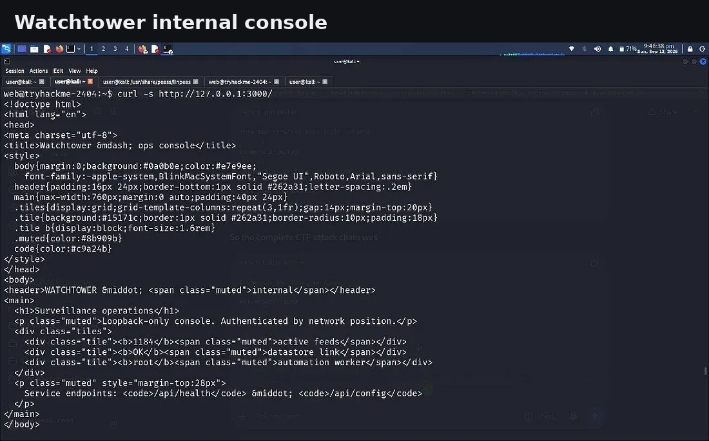
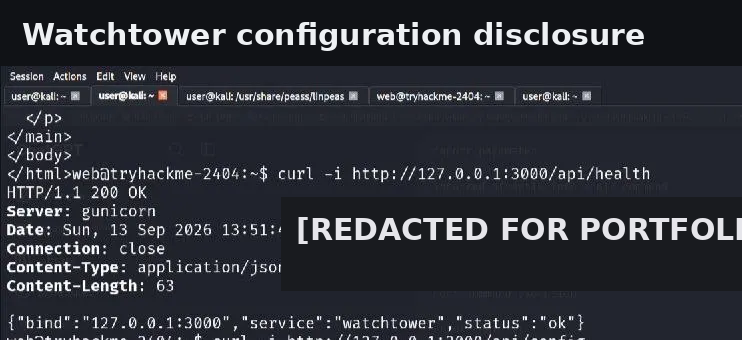
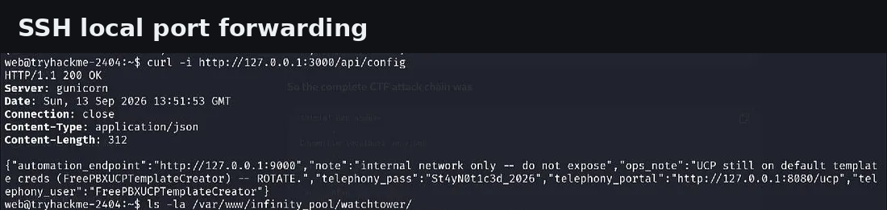
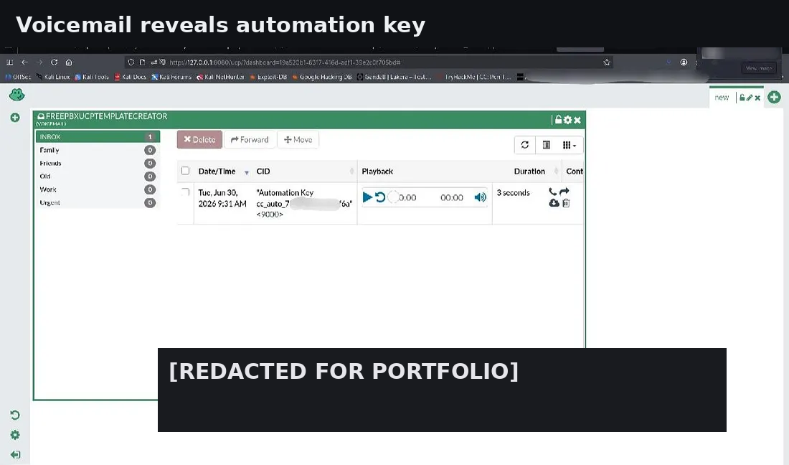

# Infinity Pool — Complete Technical Documentation

## 1. Executive Summary

This write-up documents an authorized TryHackMe assessment of the **Infinity Pool** room. The route demonstrates a realistic chained-compromise pattern where an exposed web utility leads to code execution, local service discovery reveals internal applications, application trust boundaries expose additional credentials, and an authenticated internal API provides a second path to privileged command execution.

### Documented Attack Chain

```text
Nmap
 → HTTP :80
 → robots.txt
 → /status
 → OS command injection
 → reverse shell
 → local service enumeration
 → Watchtower :3000
 → internal configuration disclosure
 → UCP :8080
 → voicemail artifact
 → automation key
 → Automation :9000
 → authenticated export endpoint
 → command injection
 → root execution
```

## 2. Assessment Scope

| Item | Value |
|---|---|
| Platform | TryHackMe |
| Room | Infinity Pool |
| Target | Lab host supplied by TryHackMe |
| Primary services | SSH, HTTP |
| Initial access | Web command injection |
| Privilege escalation | Internal authenticated command injection |
| Evidence | Screenshots captured during the lab |
| Sensitive values | Redacted in public artifacts |

## 3. Initial Enumeration

The first action was a service/version scan:

```bash
nmap <TARGET_IP> -sV
```

The scan identified SSH on TCP/22 and HTTP on TCP/80.


### Observation

Because the SSH service did not immediately provide usable authentication material, the investigation shifted to the web application.

## 4. Web Enumeration

The HTTP service was inspected manually, followed by:

```text
http://<TARGET_IP>/robots.txt
```

The response revealed two notable paths:

```text
/internal/
 /status
```

The `/internal/` path returned a 404 in the documented run. The `/status` endpoint was substantially more useful.


## 5. Command Injection in `/status`

The `/status` page implemented a network connectivity check. Normal input produced expected ping output.

The next test used a shell separator to determine whether application input was passed into a shell command context.

```text
127.0.0.1;<test-command>
```

The test produced output from the additional command, confirming command injection.


### Security Interpretation

The application was not treating the submitted host value as data only. Instead, attacker-controlled input was reaching a shell execution context.

This changes the impact from a limited connectivity check to arbitrary command execution under the service account.

## 6. Reverse Shell & Initial Access

A listener was prepared on the testing workstation and the command-injection primitive was used to obtain an interactive shell.

```bash
nc -lvnp 4444
```

The resulting session ran in the web application account.


### Shell Stabilization

A PTY was spawned and the terminal environment was adjusted to make the shell more usable. From there, user-context enumeration and filesystem navigation confirmed access to the low-privilege account.

The user flag is intentionally omitted.

## 7. Local Service Enumeration

Since the initial Nmap scan exposed only a small external attack surface, loopback services were enumerated from inside the host:

```bash
ss -lntp
```

Important listeners included:

```text
127.0.0.1:3000
127.0.0.1:9000
127.0.0.1:8080
127.0.0.1:8088
127.0.0.1:8089
127.0.0.1:3306
127.0.0.1:5038
```


### Key Finding

The services were bound to `127.0.0.1`, making them invisible to the external Nmap scan but reachable from the compromised host.

## 8. Watchtower :3000

The next pivot focused on TCP/3000:

```bash
curl -s http://127.0.0.1:3000/
```

The service identified itself as an internal Watchtower/operations console.



The page referenced API routes such as:

```text
/api/health
/api/config
```

## 9. Watchtower API Analysis

The health endpoint confirmed the service identity:

```bash
curl -i http://127.0.0.1:3000/api/health
```

Then the configuration endpoint was queried:

```bash
curl -i http://127.0.0.1:3000/api/config
```

The returned configuration disclosed another internal service, a telephony/UCP endpoint, and challenge-specific authentication material.



### Why This Mattered

This was a trust-boundary problem: a loopback-only administrative service exposed operational secrets to any process that could reach the service locally.

## 10. SSH Port Forwarding

To inspect the internal web interfaces from the testing workstation, SSH local forwarding was used.

A key pair was generated locally and authorized for the compromised account in the lab:

```bash
ssh-keygen -t ed25519 -f ~/tryhackme_ssh/thm_key
```

The tunnel followed the pattern:

```bash
ssh -i ~/tryhackme_ssh/thm_key \
  -L 3000:127.0.0.1:3000 \
  -L 9000:127.0.0.1:9000 \
  -L 8080:127.0.0.1:8080 \
  <WEB_USER>@<TARGET_IP>
```



This allowed the testing workstation to interact with services that were only listening on the target loopback interface.

## 11. UCP / Telephony Application

The forwarded TCP/8080 service exposed the FreePBX User Control Panel.


The credentials discovered from the Watchtower configuration were used only within the authorized lab.

## 12. Voicemail as an Information-Disclosure Pivot

The UCP workflow exposed voicemail-related functionality.

A voicemail message contained an operational artifact identifying an automation credential/key.



> The actual key value is redacted in this public portfolio version.

### Lesson

Credentials discovered in one internal application were not the final objective. They became the bridge into a second internal service.

## 13. Automation Service :9000

The automation endpoint was then inspected:

```bash
curl -i http://127.0.0.1:9000/
curl -i http://127.0.0.1:9000/health
```

The health response documented API structure including:

```text
GET /health
POST /jobs/export
```

The export operation required bearer-style authentication.


The endpoint also indicated that the worker operated with root privileges.

## 14. Authenticated Command Injection

The export endpoint accepted a report name and generated a shell command for an archive operation.

Conceptually, the intended command resembled:

```text
tar czf <output>.tgz <data>
```

A controlled injection test demonstrated that shell metacharacters were not safely neutralized.

The resulting shell behavior established a second command-injection vulnerability, this time inside a privileged internal service.

### Impact

Because the automation worker executed with root privileges, successful command injection meant arbitrary commands could execute in the root context.

## 15. Root Verification

A non-destructive identity check was used to establish the execution context.

The result confirmed:

```text
uid=0(root) gid=0(root)
```

The final evidence screenshot is intentionally redacted where the flag or other answer material would otherwise appear.


## 16. Final Findings

### Finding 01 — OS Command Injection in `/status`

**Category:** CWE-78 — Improper Neutralization of Special Elements used in an OS Command

**Observed impact:** Arbitrary command execution in the web service context.

**Root cause:** Attacker-controlled input was passed into a shell command without safe argument handling.

### Finding 02 — Sensitive Information Disclosure from Internal Configuration

**Category:** CWE-200 / CWE-538 style information exposure

**Observed impact:** Internal endpoint locations and reusable authentication material became available after compromising the local web context.

**Root cause:** Administrative configuration data was exposed through a loopback-only API.

### Finding 03 — Command Injection in Internal Automation API

**Category:** CWE-78

**Observed impact:** Arbitrary command execution in a root-privileged worker context.

**Root cause:** User-controlled export/report data was interpolated into a shell command.

## 17. Defensive Recommendations

1. Replace shell invocation with direct process APIs and argument arrays.
2. Strictly validate and allow-list host/report input.
3. Never interpolate untrusted input into shell command strings.
4. Store secrets in a proper secret-management system.
5. Remove reusable credentials from operational dashboards and voicemail.
6. Protect administrative APIs with real authentication and authorization, not network location alone.
7. Run automation workers as non-root users with minimal filesystem permissions.
8. Apply network segmentation to internal services.
9. Monitor unusual shell-spawn behavior from web applications and service workers.
10. Rotate any credentials that appear in logs, configuration, voicemail, or diagnostic endpoints.

## 18. Lessons Learned

Infinity Pool demonstrates the value of chaining small observations:

- the first vulnerability did not directly yield root;
- localhost-only services became important after initial access;
- configuration disclosure provided the next pivot;
- an application-level artifact revealed authentication for another service;
- a second command injection in a privileged worker completed the escalation.

The practical lesson is to keep re-enumerating after every privilege or trust-boundary change.

## 19. Evidence Handling

Public screenshots in this repository were renamed consistently and selected sensitive values were redacted. The purpose is to preserve the realism and visual flow of the assessment without publishing reusable challenge answers.

## 20. Conclusion

The documented route successfully demonstrates the complete compromise chain for the Infinity Pool training target: **external enumeration → web command injection → shell access → internal service discovery → application pivoting → authenticated internal command injection → root execution**.

This documentation is structured as a repeatable methodology reference suitable for a cybersecurity portfolio.
