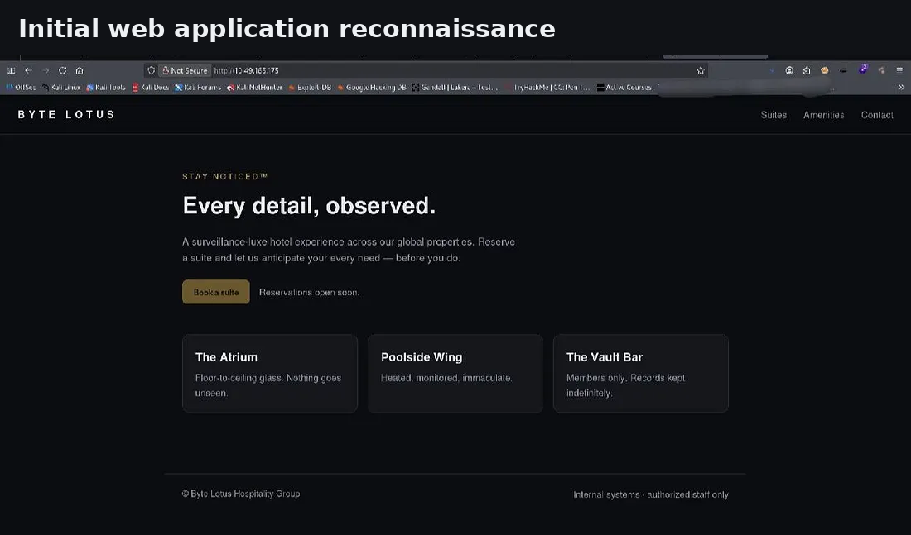
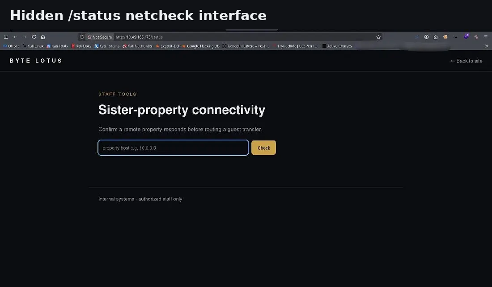
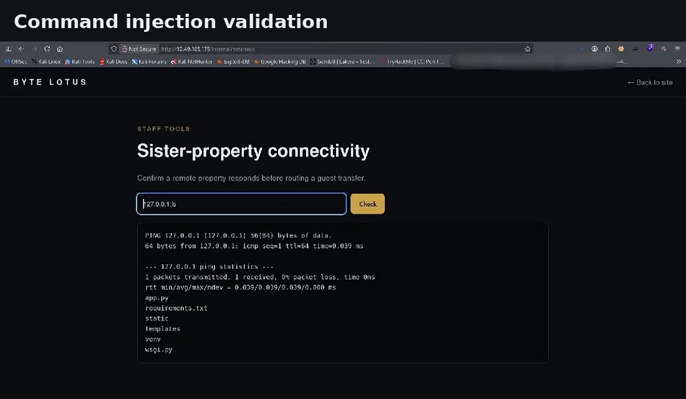
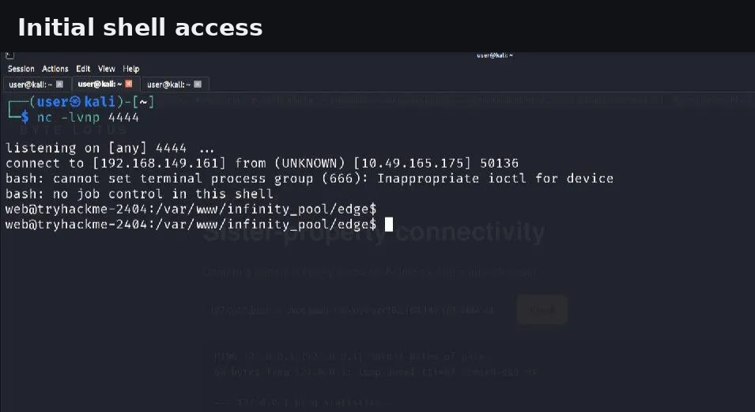
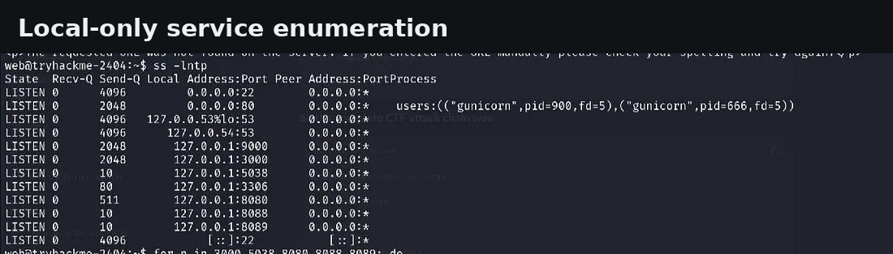
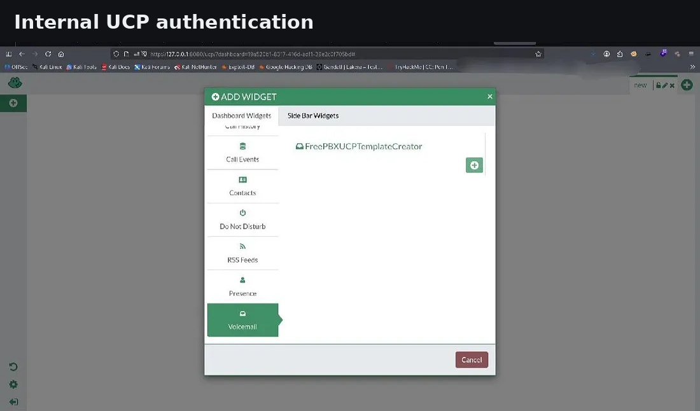
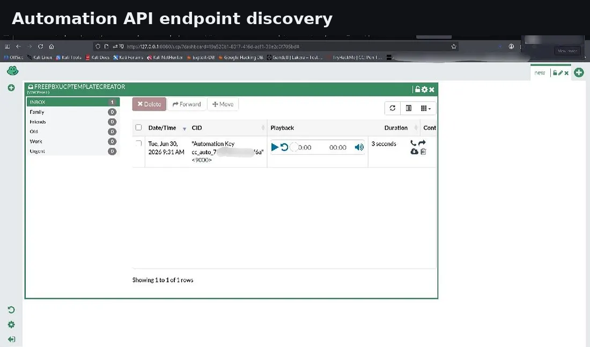
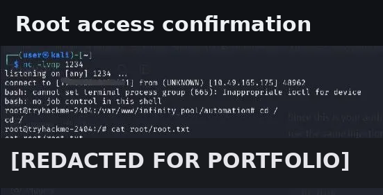

# ♾️ Infinity Pool

### Advanced Web Application Exploitation • Linux Privilege Escalation • Internal Infrastructure Pivoting

    

---

### Cybersecurity Portfolio Project

*A professional penetration testing walkthrough documenting the complete compromise lifecycle of the Infinity Pool TryHackMe room.*

**Author:** **Anurag Revankar**

SOC Analyst Aspirant • Penetration Testing Learner • Security Researcher

</div>

---

# $ project_info

```bash
anurag@portfolio:~$ cat infinity_pool_project.info

Project        : Infinity Pool
Platform       : TryHackMe
Operating System : Linux
Difficulty     : Medium
Category       : Web Security + Privilege Escalation
Status         : Completed
Documentation  : Portfolio Edition
Version        : v1.0
```

---

# Welcome

Infinity Pool is a realistic Linux-based penetration testing lab focused on **web exploitation**, **internal infrastructure discovery**, and **privilege escalation**.

Rather than relying on a single critical vulnerability, this room teaches attackers and defenders how **small security weaknesses combine into a complete system compromise**.

This documentation recreates the assessment as a professional cybersecurity engagement suitable for a GitHub portfolio.

---

# Table of Contents

- [Executive Summary](#executive-summary)
- [Attack Lifecycle](#attack-lifecycle)
- [Lab Architecture](#lab-architecture)
- [Assessment Methodology](#assessment-methodology)
- [Walkthrough Timeline](#walkthrough-timeline)
- [Technical Skills Demonstrated](#technical-skills-demonstrated)
- [Vulnerability Dashboard](#vulnerability-dashboard)
- [MITRE ATT&CK Mapping](#mitre-attck-mapping)
- [Blue Team Perspective](#blue-team-perspective)
- [Lessons Learned](#lessons-learned)

---

# Executive Summary

## Assessment Overview

Infinity Pool simulates the infrastructure of a hospitality organization where operational services are intentionally hidden behind localhost and interconnected through trusted internal applications.

The assessment followed a complete penetration testing methodology:

- Reconnaissance
- Web Enumeration
- Command Injection Discovery
- Reverse Shell
- Linux Enumeration
- Internal Dashboard Investigation
- REST API Enumeration
- SSH Local Port Forwarding
- Credential Chaining
- Root Privilege Escalation

Every stage expanded the attack surface.

---

## Assessment Objectives

<table>
<tr>
<th width="40%">Objective</th>
<th>Result</th>
</tr>

<tr>
<td>Identify public services</td>
<td>✅ Completed</td>
</tr>

<tr>
<td>Discover hidden endpoints</td>
<td>✅ Completed</td>
</tr>

<tr>
<td>Gain command execution</td>
<td>✅ Completed</td>
</tr>

<tr>
<td>Establish reverse shell</td>
<td>✅ Completed</td>
</tr>

<tr>
<td>Enumerate localhost services</td>
<td>✅ Completed</td>
</tr>

<tr>
<td>Pivot through internal applications</td>
<td>✅ Completed</td>
</tr>

<tr>
<td>Escalate privileges to root</td>
<td>✅ Completed</td>
</tr>

<tr>
<td>Produce professional documentation</td>
<td>✅ Completed</td>
</tr>

</table>

---

# Attack Lifecycle

The room demonstrates a chained compromise across multiple trust boundaries.

<p align="center">


</p>

---

## Visual Attack Flow

```text
Internet
   │
   ▼
HTTP Landing Page
   │
robots.txt
   │
   ▼
Hidden Status Endpoint
   │
OS Command Injection
   │
   ▼
Reverse Shell
   │
   ▼
Linux Enumeration
   │
   ▼
Watchtower Dashboard
   │
   ▼
Configuration API
   │
   ▼
FreePBX UCP
   │
Voicemail Artifact
   │
   ▼
Automation API
   │
Authenticated Command Injection
   │
   ▼
Root Command Execution
```

---

# Attack Progress Dashboard

| Stage | Status |
|--------|--------|
| Network Reconnaissance | 🟢 Complete |
| Web Enumeration | 🟢 Complete |
| Hidden Endpoint Discovery | 🟢 Complete |
| OS Command Injection | 🟢 Complete |
| Reverse Shell | 🟢 Complete |
| Shell Stabilization | 🟢 Complete |
| Linux Enumeration | 🟢 Complete |
| Internal Dashboard Discovery | 🟢 Complete |
| REST API Enumeration | 🟢 Complete |
| SSH Tunnel Pivot | 🟢 Complete |
| Credential Discovery | 🟢 Complete |
| Root Privilege Escalation | 🟢 Complete |

---

# Lab Architecture

## Hospitality Infrastructure

The Infinity Pool environment contains multiple interconnected applications.

```text
                   Internet
                       │
                       ▼
      Byte Lotus Hospitality Web Portal
                       │
        ┌──────────────┴──────────────┐
        │                             │
        ▼                             ▼
   Public Landing Page          /status Endpoint
                                      │
                                      ▼
                              Command Injection
                                      │
                                      ▼
                               Reverse Shell
                                      │
                                      ▼
                          Linux Operating System
                                      │
        ┌──────────────┬──────────────┴─────────────┐
        │              │                            │
        ▼              ▼                            ▼
 Watchtower         FreePBX UCP              Automation API
   TCP/3000           TCP/8080                 TCP/9000
        │              │                            │
        ▼              ▼                            ▼
 Config API       Voicemail System          Export Worker
        │              │                            │
        └──────────────┴──────────────┬─────────────┘
                                      ▼
                                Root Context
```

---

# Assessment Methodology

The engagement follows industry-style penetration testing phases inspired by PTES and OWASP WSTG.

| Phase | Goal |
|--------|------|
| Reconnaissance | Identify exposed infrastructure. |
| Enumeration | Discover web technologies and hidden resources. |
| Vulnerability Discovery | Validate insecure input handling. |
| Exploitation | Achieve remote code execution. |
| Initial Access | Obtain Linux shell. |
| Post Exploitation | Enumerate operating system. |
| Internal Discovery | Map localhost services. |
| Pivoting | Investigate internal applications. |
| Privilege Escalation | Execute commands as root. |
| Reporting | Document findings professionally. |

---

# Walkthrough Timeline

## Phase 1 — Reconnaissance

Discover the external attack surface.

<p align="center">



</p>

### Key Activities

- Service Enumeration
- HTTP Fingerprinting
- Landing Page Review

---

## Phase 2 — Hidden Endpoint Discovery

robots.txt exposed operational resources.

<p align="center">



</p>

### Key Discovery

```text
/status
/internal/
```

---

## Phase 3 — OS Command Injection

Input validation testing identified remote command execution.

<p align="center">



</p>

### Security Classification

| Type | Value |
|------|-------|
| CWE | CWE-78 |
| OWASP | A03 Injection |
| Impact | Remote Code Execution |

---

## Phase 4 — Reverse Shell

Interactive Linux shell established.

<p align="center">



</p>

### Post Exploitation Begins

- PTY Stabilization
- User Enumeration
- Filesystem Discovery

---

## Phase 5 — Linux Enumeration

Enumerating localhost services dramatically expanded visibility.

<p align="center">



</p>

### Internal Services Found

| Port | Service |
|------|---------|
| 3000 | Watchtower |
| 8080 | FreePBX UCP |
| 9000 | Automation API |
| 3306 | MySQL |
| 5038 | Telephony Service |

---

# Technical Skills Demonstrated

## Offensive Security Skills

<table>
<tr>
<td width="50%">

### Web Security

- Nmap Enumeration
- robots.txt Discovery
- HTTP Enumeration
- Command Injection
- Reverse Shells

</td>

<td width="50%">

### Linux Exploitation

- Bash
- PTY Stabilization
- Network Enumeration
- SSH Port Forwarding
- Privilege Escalation

</td>
</tr>
</table>

---

## Security Engineering Skills

<table>
<tr>
<td width="50%">

### Infrastructure Analysis

- Service Discovery
- Internal Dashboard Investigation
- REST API Enumeration
- Configuration Disclosure

</td>

<td width="50%">

### Reporting

- MITRE ATT&CK Mapping
- OWASP Mapping
- Risk Assessment
- Defensive Recommendations

</td>
</tr>
</table>

---

# Technology Stack

| Technology | Role |
|------------|------|
| Linux | Target Operating System |
| Gunicorn | Python Web Server |
| Python | Backend Application |
| Watchtower | Operations Dashboard |
| FreePBX | Internal Telephony Platform |
| REST API | Automation Interface |
| OpenSSH | Internal Pivoting |
| Netcat | Reverse Shell Listener |

---

# Assessment Scope

## Included

- External Enumeration
- Web Exploitation
- Linux Enumeration
- Internal Services
- Privilege Escalation
- Security Analysis
- Defensive Recommendations

## Redacted

- User Flag
- Root Flag
- Passwords
- API Keys
- Tokens
- Secrets
- Private Keys

> This repository demonstrates **methodology** rather than challenge answers.

---

# Threat Model

## Initial Exposure

<table>
<tr>
<th>Public Asset</th>
<th>Purpose</th>
</tr>

<tr>
<td>TCP/22</td>
<td>SSH</td>
</tr>

<tr>
<td>TCP/80</td>
<td>Web Application</td>
</tr>

</table>

---

## Internal Exposure

<table>
<tr>
<th>Service</th>
<th>Purpose</th>
</tr>

<tr>
<td>Watchtower</td>
<td>Operational Dashboard</td>
</tr>

<tr>
<td>UCP</td>
<td>Telephony Administration</td>
</tr>

<tr>
<td>Automation API</td>
<td>Administrative Worker</td>
</tr>

<tr>
<td>Database</td>
<td>Internal Storage</td>
</tr>

</table>

---

# Security Observation

Infinity Pool illustrates a realistic enterprise assumption:

> **"If it's bound to localhost, it's trusted."**

The walkthrough demonstrates why that assumption fails once an attacker gains initial shell access.

---

---

<div align="center">

# ⚡ Exploitation Walkthrough

*A visual timeline documenting every major phase of the Infinity Pool assessment.*

</div>

---

# 🛰️ Phase 6 — Watchtower Internal Operations Dashboard

The first localhost-only administrative application discovered during post-exploitation was **Watchtower**, an operational monitoring dashboard accessible only from inside the compromised host.


---

## What Was Identified?

<table>
<tr>
<th width="35%">Component</th>
<th>Observation</th>
</tr>

<tr>
<td>Dashboard</td>
<td>Internal infrastructure monitoring interface.</td>
</tr>

<tr>
<td>Status Feed</td>
<td>Operational service health information.</td>
</tr>

<tr>
<td>REST API</td>
<td>Health and configuration endpoints discovered.</td>
</tr>

<tr>
<td>Administrative Notes</td>
<td>Infrastructure metadata exposed.</td>
</tr>

</table>

---

## Security Observation

> Watchtower trusted **localhost** instead of authenticated users.

This is a common enterprise security anti-pattern where internal dashboards assume local requests are always trusted.

---

# 🔍 Phase 7 — Configuration API Enumeration

The configuration endpoint exposed internal infrastructure relationships.


---

## Configuration Disclosure

| Information Exposed | Security Impact |
|---------------------|-----------------|
| Internal Service URLs | High |
| Telephony Portal | High |
| Automation Worker Reference | High |
| Administrative Notes | Medium |
| Infrastructure Metadata | Medium |

---

## Security Finding

> **Sensitive Configuration Disclosure**

The endpoint leaked information useful for lateral movement after initial compromise.

| Category | Value |
|----------|-------|
| CWE | CWE-200 |
| Severity | High |
| Risk | Information Disclosure |

---

# 🔗 Phase 8 — SSH Local Port Forwarding

Localhost services became accessible securely through SSH tunneling.


---

## Tunnel Architecture

```text
Kali Linux
     │
localhost:3000
localhost:8080
localhost:9000
     │
SSH Tunnel
     │
127.0.0.1 Services
     │
Target Linux Host
```

---

## Benefits During Assessment

- Browser access to internal dashboards.
- REST API testing.
- Local application interaction.
- No firewall modification required.

---

# ☎️ Phase 9 — FreePBX User Control Panel (UCP)

Authentication exposed the internal telephony administration interface.



---

## Areas Investigated

| Section | Purpose |
|---------|---------|
| Dashboard | User overview |
| Voicemail | Internal messages |
| Settings | Account configuration |
| Notifications | Operational communication |

---

## Security Perspective

Operational collaboration platforms frequently become valuable post-exploitation targets because they contain internal communications.

---

# 🔐 Phase 10 — Voicemail Artifact Discovery

Voicemail contained an operational authentication artifact related to the automation platform.


---

## Portfolio Redaction Policy

The following information has been intentionally removed:

- API Keys
- Authentication Tokens
- Passwords
- User Flag
- Root Flag
- Secrets

Only the methodology is preserved.

---

# 🤖 Phase 11 — Automation API Investigation

The Automation Service exposed privileged administrative functionality.



---

## API Enumeration Summary

| Endpoint | Purpose |
|----------|---------|
| `/health` | Service Health |
| `/jobs/export` | Export Worker |
| Internal APIs | Administrative Operations |

---

## Security Observation

The export endpoint constructed operating system commands using user-controlled input.

This became the privilege escalation vector.

---

# 👑 Phase 12 — Root Privilege Escalation

Authenticated command injection resulted in root-level command execution.



---

## Final Result

<table>
<tr>
<th width="40%">Objective</th>
<th>Status</th>
</tr>

<tr>
<td>Root Execution</td>
<td>✅ Achieved</td>
</tr>

<tr>
<td>Privilege Escalation</td>
<td>✅ Successful</td>
</tr>

<tr>
<td>Challenge Flag</td>
<td>🔒 Redacted</td>
</tr>

</table>

---

<div align="center">

# 🧬 Complete Attack Chain

</div>

```text
Nmap Scan
    │
    ▼
HTTP Enumeration
    │
    ▼
robots.txt Discovery
    │
    ▼
Hidden Status Endpoint
    │
    ▼
OS Command Injection
    │
    ▼
Reverse Shell
    │
    ▼
Linux Enumeration
    │
    ▼
Watchtower Dashboard
    │
Configuration Disclosure
    │
    ▼
FreePBX UCP
    │
Voicemail Artifact
    │
    ▼
Automation Authentication
    │
    ▼
Automation API
    │
Authenticated Command Injection
    │
    ▼
Root Command Execution
```

---

# 📊 Vulnerability Dashboard

<table>
<tr>
<th>Finding</th>
<th>Severity</th>
<th>CWE</th>
</tr>

<tr>
<td>OS Command Injection</td>
<td>🔴 High</td>
<td>CWE-78</td>
</tr>

<tr>
<td>Configuration Disclosure</td>
<td>🟠 High</td>
<td>CWE-200</td>
</tr>

<tr>
<td>Credential Exposure</td>
<td>🟠 High</td>
<td>CWE-522</td>
</tr>

<tr>
<td>Localhost Trust Boundary Abuse</td>
<td>🔴 High</td>
<td>CWE-284</td>
</tr>

<tr>
<td>Authenticated Command Injection</td>
<td>🔴 Critical</td>
<td>CWE-78</td>
</tr>

</table>

---

# MITRE ATT&CK Mapping

<table>
<tr>
<th width="22%">Technique</th>
<th>Description</th>
</tr>

<tr>
<td>T1595</td>
<td>Active Service Scanning</td>
</tr>

<tr>
<td>T1190</td>
<td>Exploit Public-Facing Application</td>
</tr>

<tr>
<td>T1059.004</td>
<td>Unix Shell</td>
</tr>

<tr>
<td>T1105</td>
<td>Ingress Tool Transfer</td>
</tr>

<tr>
<td>T1046</td>
<td>Network Service Discovery</td>
</tr>

<tr>
<td>T1021.004</td>
<td>SSH Remote Services</td>
</tr>

<tr>
<td>T1552</td>
<td>Unsecured Credentials</td>
</tr>

<tr>
<td>T1078</td>
<td>Valid Accounts</td>
</tr>

<tr>
<td>T1068</td>
<td>Privilege Escalation</td>
</tr>

</table>

---

# 🛡️ OWASP Top 10 Coverage

<table>
<tr>
<th width="32%">OWASP Category</th>
<th>Observed During Assessment</th>
</tr>

<tr>
<td>A01 — Broken Access Control</td>
<td>Localhost trust assumptions.</td>
</tr>

<tr>
<td>A03 — Injection</td>
<td>Command Injection vulnerabilities.</td>
</tr>

<tr>
<td>A05 — Security Misconfiguration</td>
<td>Configuration endpoint exposure.</td>
</tr>

<tr>
<td>A07 — Authentication Failures</td>
<td>Operational credential exposure.</td>
</tr>

<tr>
<td>A09 — Logging & Monitoring Failures</td>
<td>No detection for shell execution.</td>
</tr>

</table>

---

<div align="center">

# 🔵 Blue Team Perspective

*How defenders could detect and prevent this attack chain.*

</div>

---

## Detection Opportunities

| Detection Area | Why Monitor |
|----------------|------------|
| Shell Execution | Gunicorn spawning Bash. |
| SSH Local Forwarding | Internal pivoting. |
| Export API Requests | Abuse of automation worker. |
| Configuration API Access | Unauthorized enumeration. |
| Reverse Shell Connections | Outbound TCP sessions. |

---

## Hunt Ideas

### Suspicious Child Processes

```text
bash
sh
python
curl
tar
nc
```

Spawned from:

- Gunicorn
- Python Workers
- Automation Service

---

### Network Indicators

```text
SSH -L
127.0.0.1:3000
127.0.0.1:8080
127.0.0.1:9000
```

---

### API Abuse

Look for:

- Repeated `/jobs/export`
- Unusual report names.
- Authentication anomalies.
- Long-running export jobs.

---

# 🔒 Hardening Checklist

## Web Application Security

- [x] Validate all user input.
- [x] Remove shell execution.
- [x] Sanitize host parameters.
- [x] Allow-list destinations.
- [x] Use safe subprocess execution.

---

## API Security

- [x] Authenticate internal APIs.
- [x] Validate request schemas.
- [x] Avoid shell invocation.
- [x] Restrict administrative endpoints.

---

## Secrets Management

- [x] Remove secrets from configuration APIs.
- [x] Never store credentials in voicemail.
- [x] Rotate exposed authentication artifacts.
- [x] Use centralized secret management.

---

## Infrastructure Security

- [x] Least privilege automation workers.
- [x] Network segmentation.
- [x] Service-to-service authentication.
- [x] Audit localhost administrative services.

---

# 📸 Evidence Gallery

## External Reconnaissance

| | |
|---|---|
|  |  |
| Landing Page | Hidden Status Endpoint |

---

## Initial Exploitation

| | |
|---|---|
|  |  |
| Command Injection | Reverse Shell |

---

## Internal Enumeration

| | |
|---|---|
|  |  |
| Local Services | Watchtower Dashboard |

---

## Internal Pivoting

| | |
|---|---|
|  |  |
| Configuration API | SSH Port Forwarding |

---

## Credential Discovery

| | |
|---|---|
|  |  |
| FreePBX UCP | Voicemail Artifact |

---

## Privilege Escalation

| | |
|---|---|
|  |  |
| Automation API | Root Execution |

---

# 📚 Skills Demonstrated

<table>
<tr>
<th width="50%">Offensive Security</th>
<th width="50%">Defensive Security</th>
</tr>

<tr>
<td>

- Network Reconnaissance
- Web Enumeration
- Command Injection
- Reverse Shells
- Linux Enumeration
- SSH Pivoting
- REST API Enumeration
- Privilege Escalation

</td>

<td>

- Attack Surface Mapping
- Configuration Review
- MITRE ATT&CK
- OWASP Analysis
- Risk Assessment
- Detection Engineering
- Hardening Recommendations
- Incident Indicators

</td>
</tr>

</table>

---

# 🎓 Learning Outcomes

Infinity Pool provided practical experience with:

- Web Application Security Testing.
- Linux Post Exploitation.
- Localhost Trust Boundary Analysis.
- Internal Dashboard Investigation.
- Authentication Artifact Discovery.
- REST API Security.
- Command Injection.
- Privilege Escalation.
- Professional Security Reporting.

---

# 📁 Repository Resources

<table>
<tr>
<th>Resource</th>
<th>Description</th>
</tr>

<tr>
<td><code>README.md</code></td>
<td>Repository landing page.</td>
</tr>

<tr>
<td><code>Documentation/Documentation.md</code></td>
<td>Complete penetration testing report.</td>
</tr>

<tr>
<td><code>Documentation/Infinity_Pool_Documentation.docx</code></td>
<td>Professional report format.</td>
</tr>

<tr>
<td><code>Resources/notes.md</code></td>
<td>Quick methodology notes.</td>
</tr>

<tr>
<td><code>SECURITY.md</code></td>
<td>Responsible disclosure policy.</td>
</tr>

</table>

---

# ⚖️ Responsible Use

> This documentation represents activities performed **only inside an authorized TryHackMe laboratory environment**.

### Redacted Information

- 🚫 User Flag
- 🚫 Root Flag
- 🚫 Passwords
- 🚫 API Tokens
- 🚫 Automation Keys
- 🚫 Sensitive Credentials

This repository exists solely for **education**, **security research**, and **portfolio presentation**.

---

<div align="center">

# 👨‍💻 Author

## Anurag Revankar

### Cybersecurity Portfolio

SOC Analyst • Penetration Tester • Security Enthusiast

Building practical cybersecurity projects through:

🛡️ TryHackMe Labs

🌐 Web Application Security

🖥️ Linux Privilege Escalation

🏢 Active Directory Labs

⚙️ Security Automation

📊 Detection Engineering

---

### ⭐ If you found this walkthrough helpful, consider starring the repository.

**Infinity Pool — Professional TryHackMe Walkthrough**


</div>
